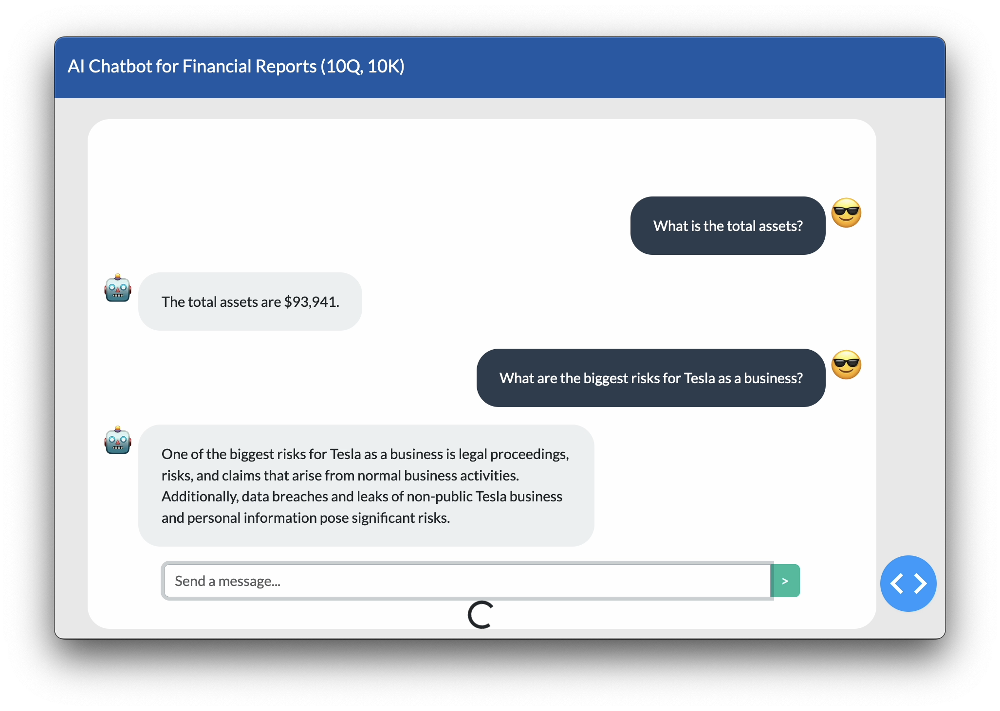
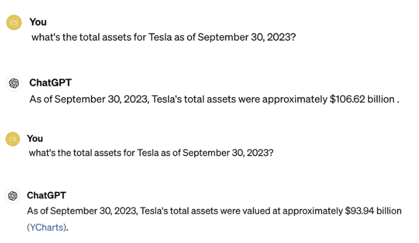
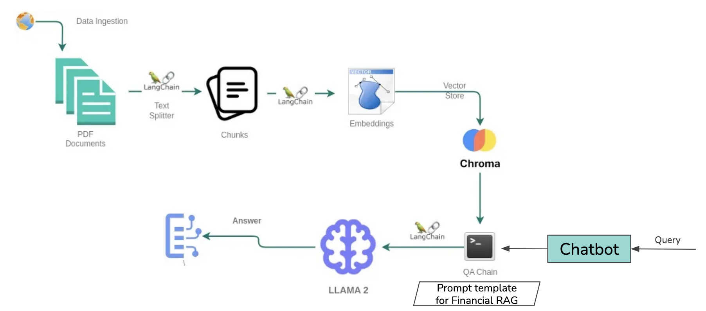
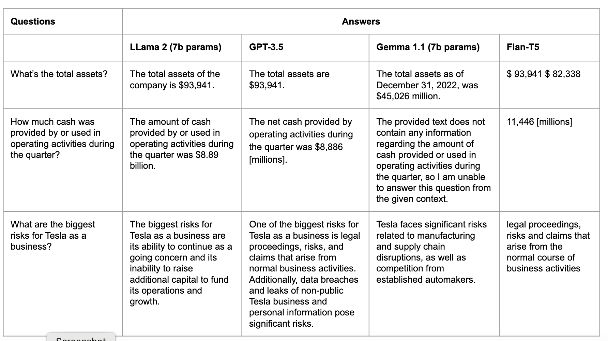
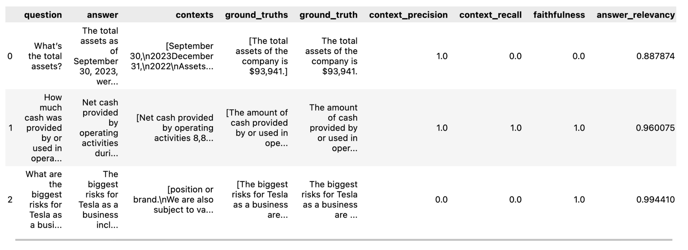

# Chatbot for Document Summarization Using RAG

This project leverages Retrieval Augmented Generation (RAG) to build a chatbot capable of summarizing financial documents like 10Q and 10K reports.



## Problem Overview

- **Objective:** Given a financial report in PDF format and a user query, retrieve relevant details from the document and generate an accurate, contextually relevant response.
- **Data Handling:** Ingest and process financial report PDFs, splitting them into manageable text chunks to improve retrieval efficiency for long documents.
- **Retrieval-Augmented Generation (RAG):** This technique combines document retrieval with the generative power of large language models (LLMs) to provide accurate and concise answers.
- **LLM Selection:** Evaluating models such as GPT-3.5-turbo, LLaMA 2, and Gemma 1.1 to find the best fit for financial document summarization.
- **Prompt and Conversation Design:** A carefully structured prompt template is used to generate concise, two-sentence financial summaries.
- **User Interface:** A chatbot-like interface designed for seamless interaction with users.

<figure>
    
    <figcaption>Example of hallucinated answers generated by GPT-4 without RAG.</figcaption>
</figure>

GPT-4 often produces inconsistent responses to the same query (hallucinations). This issue is resolved by integrating RAG, providing more reliable answers.

## System Architecture


Adapted from [GoOpenAI blog](https://blog.gopenai.com/retrieval-augmented-generation-rag-using-llama-2-chromadb-together-ai-for-retrieval-qa-80e7045a6c79)

## Models and Experiments

We conducted experiments using several large language models to determine their effectiveness in this context:

1. GPT-3.5
2. LLaMA 2
3. Gemma 1.1
4. Flan-T5



## Evaluation Metrics

The project was evaluated on the following metrics:

- **Faithfulness:** Ensures that the generated response is factually accurate based on the retrieved context. A response is faithful if all claims can be validated against the provided context.
- **Answer Relevance:** Assesses how well the answer matches the query, penalizing responses that are incomplete, redundant, or contain irrelevant information.
- **Context Recall:** Measures how well the retrieved context matches the annotated answer, used as the ground truth.
- **Context Precision:** Evaluates whether all relevant items in the retrieved contexts are ranked highly.



## Installation

To set up the project locally, follow these steps:

```
pip install -r requirements.txt
```

## Running the Application

To start the chatbot:

```
python index.py
```

## Code and Notebooks

- LLaMA 2: [rag_llama2.ipynb](./rag_llama2.ipynb)
- Gemma 1.1: [rag_gemma1.ipynb](./rag_gemma1.ipynb)
- GPT-3.5: [chatbot_model.py](./pages/chatbot/chatbot_model.py)
- Evaluation: [eval.py](./eval.py)